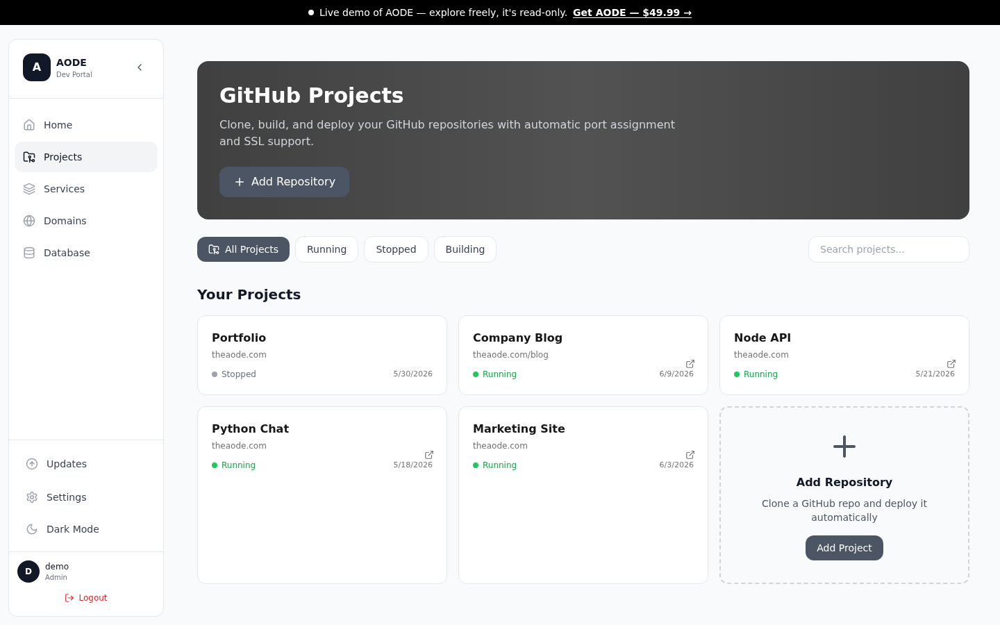
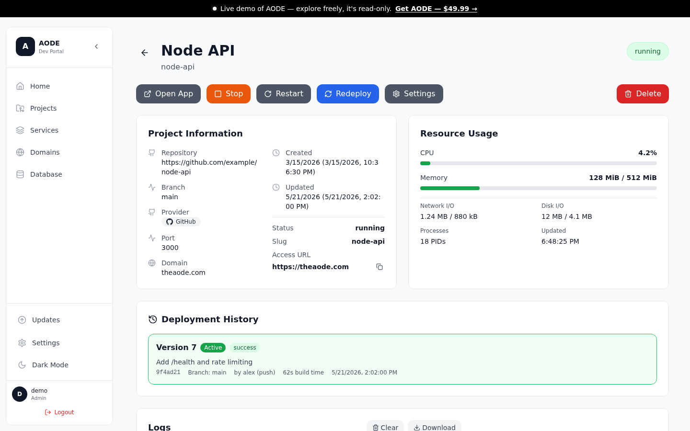
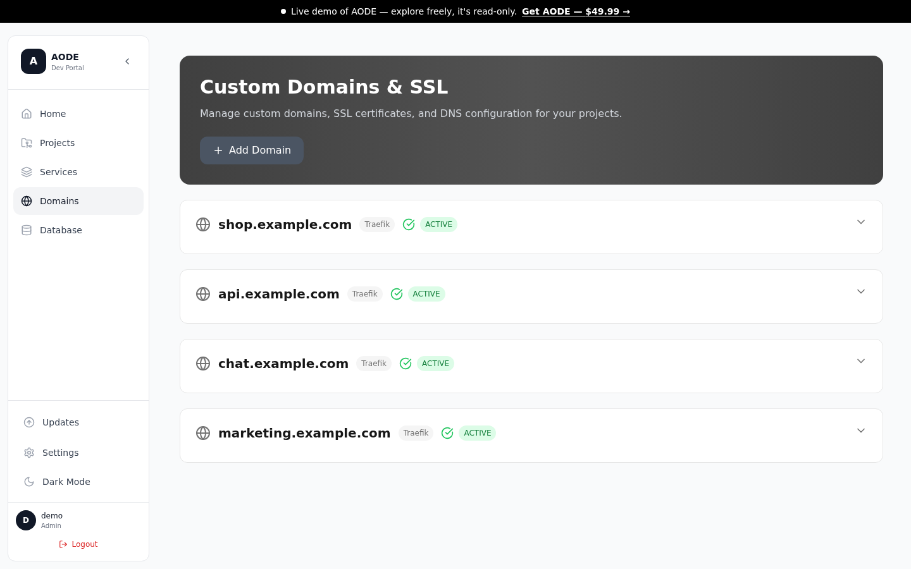
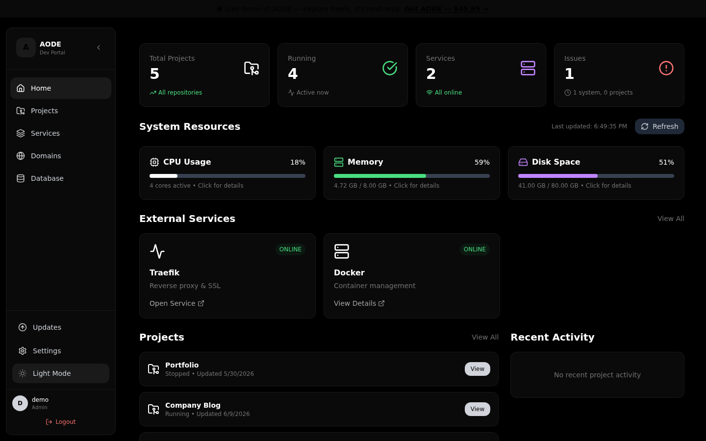
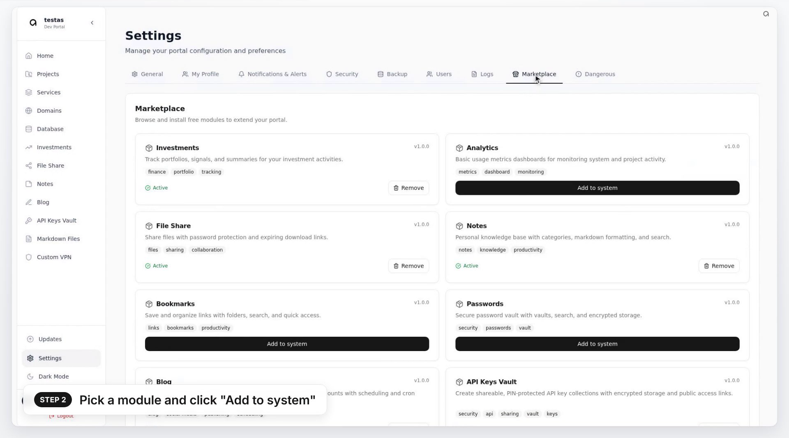
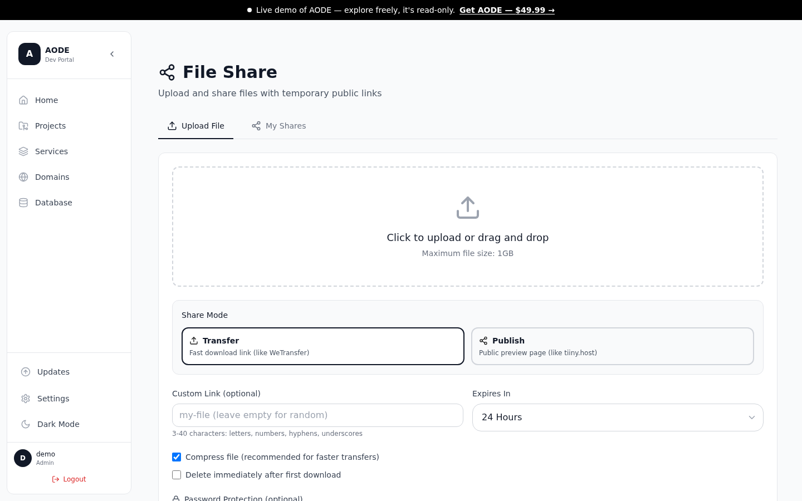
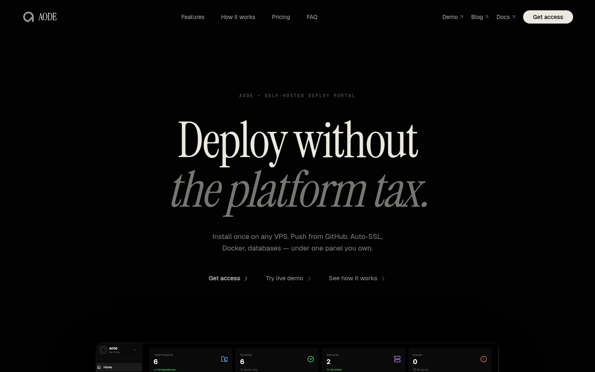
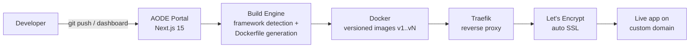

# AODE — A Self-Hosted Deployment Platform I Built and Run Solo

**Git push → live app with SSL on your own server. A commercial Vercel/Netlify alternative, designed, built, and operated by one person.**


AODE is a self-hosted deployment platform: install it on any VPS and you get push-to-deploy from Git, automatic Dockerfile generation for 16 frameworks, versioned rollbacks, custom domains with automatic SSL, database provisioning, and full monitoring — all from one dashboard. I designed, built, and operate it solo, and it runs in production today at [theaode.com](https://theaode.com).

**▶ Try it yourself: [demo.theaode.com](https://demo.theaode.com) — live read-only demo, no signup.**

## Why this repo

AODE is a commercial product, so the source is private. This repo is the proof-of-work instead: a documented case study with real screenshots from the production system, the actual architecture, and the engineering decisions behind it. Everything described here is real and running. See [LICENSE-NOTE.md](LICENSE-NOTE.md).

## By the numbers

| | |
|---|---|
| **API routes** | 219 (Next.js App Router route files) |
| **Database models** | 58 (Prisma) |
| **Core library modules** | 51 |
| **Frameworks auto-detected** | 16 (Node, Next.js, Vite, CRA, Python, Django, Flask, Go, Rust, Java, Spring Boot, PHP, Laravel, Ruby, .NET, static HTML) |
| **Git providers** | 3 — GitHub, GitLab, Bitbucket, all with webhook push-to-deploy |
| **Marketplace modules** | 11 installable dashboard modules |
| **Current version** | v0.5.28, distributed via licensed installer + chained auto-updates |
| **Team size** | 1 — me |

## What it does

- **Git push-to-deploy** — connect a GitHub, GitLab, or Bitbucket repo; a webhook push triggers clone → build → deploy. Access tokens are encrypted at rest.
- **Zero-config builds** — the engine auto-detects 16 frameworks/runtimes and generates a Dockerfile. No build config required for the common cases.
- **Versioned rollbacks** — every deploy builds a versioned image (v1, v2, …). One click rolls back to any previous version.
- **Custom domains + auto SSL** — add a domain, AODE writes the Traefik route and Let's Encrypt issues the certificate automatically.
- **Database provisioning** — one-click PostgreSQL databases per project, shared-database support, automatic env-var injection, `.env.example` detection.
- **Module marketplace** — 11 installable dashboard modules (Investments, Analytics, File Share, Notes, Bookmarks, Passwords, Blog, API Keys, Markdown, VPN/WireGuard, Tasks). Each adds its own routes, UI, and database tables at install time.
- **Monitoring & ops** — CPU/memory/disk/network metrics, per-container stats, deduplicated system alerts, traffic analytics, log viewers, automated backups, and host OS security-update management from the UI.
- **Licensed distribution** — one-command install with license-key validation, SHA256-verified packages, and a chained in-app update system that walks fresh installs forward to the latest release:

  ```bash
  curl -fsSL https://install.aode.tech/install-secure.sh | sudo bash -s <LICENSE-KEY>
  ```

## Screenshots

All screenshots are captured from the live demo instance ([demo.theaode.com](https://demo.theaode.com)) and real product tutorial footage. Motion versions: [dashboard tour](assets/videos/dashboard-tour.mp4) · [real deployment end-to-end](assets/videos/real-deploy.mp4) · [promo](assets/videos/flagship-promo.mp4).

<details>
<summary><b>Deploy</b> — projects, deployment detail, domains</summary>


*Every app on the server, with status, at a glance.*


*A project's control page: start/stop/redeploy, live resource usage, and versioned deployment history — any previous version is a one-click rollback target.*


*Add a domain; Traefik routing and Let's Encrypt SSL are handled automatically.*

</details>

<details>
<summary><b>Operate</b> — dashboard, host updates, dark mode</summary>


*The main dashboard: projects, live CPU/memory/disk metrics, services, and recent activity in one view.*


*Portal self-updates and host OS security patches, applied directly from the UI.*


*The full design system ships in light and dark mode.*

</details>

<details>
<summary><b>Extend</b> — marketplace, file sharing, public site</summary>


*11 installable modules that add routes, UI, and database tables on install — frame from the module tutorial.*


*Built-in file sharing with passwords, expiration, and public preview pages.*


*The public product site at theaode.com.*

</details>

## Architecture at a glance



Deep dives:

- [docs/architecture.md](docs/architecture.md) — system design: portal, build engine, routing, data model.
- [docs/deployment-pipeline.md](docs/deployment-pipeline.md) — clone → detect → build → version → route → SSL, plus rollbacks and webhooks.
- [docs/operations.md](docs/operations.md) — monitoring, alerting, backups, self-hosted email, running it in production.
- [docs/ai-workflow.md](docs/ai-workflow.md) — how I run an AI-augmented engineering workflow with hard guardrails.

**A note on what's deliberately left out.** AODE is a commercial product, and a deployment platform is a high-value target — it holds Git credentials and controls a server. So this case study intentionally documents *what* the system does and *why* it's designed the way it is, not the implementation details of *how*. In particular, the security architecture (auth internals, token handling, hardening measures) is not published at all. I'm happy to walk through any of it in a technical interview.

## Tech stack

| Layer | Choice |
|---|---|
| Frontend & API | Next.js 15 (App Router), TypeScript |
| Database | Prisma ORM + SQLite (portal), one-click PostgreSQL for deployed apps |
| Containers | Docker Engine API — versioned images, resource-limited containers |
| Routing & SSL | Traefik reverse proxy + Let's Encrypt |
| Security | Session auth with 2FA, role-based access control, encrypted credentials at rest (details intentionally not published) |
| Email | Self-hosted mail server (docker-mailserver) with SPF/DKIM/DMARC, nodemailer, multi-SMTP support |
| UI | Tailwind + custom design system (semantic tokens, grayscale primary) |
| Distribution | Licensed one-command installer, SHA256-verified packages, chained in-app updates |

## How it's built

I run an AI-augmented engineering workflow: an AI coding agent operates on the production environment as a supervised junior engineer, boxed in by permission allowlists, pre-execution hooks that block destructive commands, custom release and diagnostics automations, and a persistent knowledge base of runbooks. It speeds up routine work roughly 5–10x — but the leverage comes from the guardrail and verification system I designed around it. Full write-up: [docs/ai-workflow.md](docs/ai-workflow.md).

## About the author

**Armandas Kaleinykas** — full-stack developer, AI engineer, and automation specialist. AODE is entirely my own work: I designed it, built it, and operate it in production, solo — product, backend, frontend, infrastructure, security, distribution, and marketing.

I'm currently open to **full-stack, AI engineering, and automation roles**.

- Email: [armandas.kaleinykas@gmail.com](mailto:armandas.kaleinykas@gmail.com)
- LinkedIn: [linkedin.com/in/armandas-kaleinykas-127461176](https://www.linkedin.com/in/armandas-kaleinykas-127461176/)
- Product: [theaode.com](https://theaode.com) · Live demo: [demo.theaode.com](https://demo.theaode.com)
