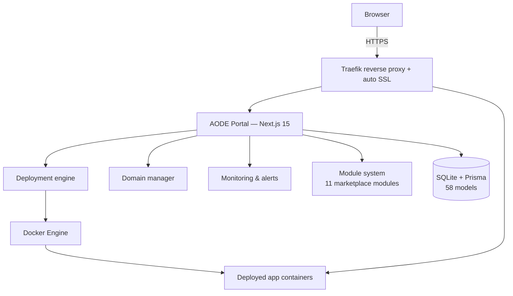

[← Back to overview](../README.md)

# Architecture

AODE is a self-hosted deployment platform — a Vercel/Netlify alternative you run on your own VPS. I designed and built it solo, and it runs in production today at [theaode.com](https://theaode.com). This document explains how the system is put together at a level that shows the engineering thinking. It deliberately stops short of implementation detail: AODE is a commercial product, and the specifics of *how* each mechanism is built stay private. I'm happy to go deeper in a technical interview.

If you want to click around instead of reading: [demo.theaode.com](https://demo.theaode.com) is a read-only live instance with sample data.

## System overview

The entire platform is **one Next.js 15 application** (App Router, TypeScript). It is simultaneously:

- **The product UI** — the dashboard users log into to deploy projects, manage domains, watch metrics.
- **The control plane** — 219 API routes orchestrating container builds, routing, git operations, host metrics, and email.

There is no separate backend service, no job queue cluster, no message broker. State lives in **SQLite via Prisma** (58 models). Traefik sits in front as the reverse proxy and terminates TLS with Let's Encrypt certificates it obtains automatically.

Everything — portal, deployed customer apps, databases, the mail server, monitoring — lives on a single VPS that the customer owns.

## Design principles

Rather than a recipe, here is the reasoning that shaped the system — the part that transfers to any platform work:

- **Appliance, not cluster.** AODE is a single-tenant appliance: one instance, one VPS, one owner. Every choice follows from that — a zero-ops embedded database instead of a second stateful service, one process instead of microservices, one version number instead of a fleet. I refuse to pay the distributed-systems tax before the workload demands it, and for this product it never does.
- **Meet users where they are.** The target user has a repo, not a Dockerfile. The platform owns the containerization expertise centrally — it recognizes **16 frameworks and runtimes** and produces the build itself, while still respecting a hand-written Dockerfile when a power user brings one.
- **Immutable artifacts make recovery boring.** Every deploy produces a versioned, immutable artifact that stays available. Rollback is therefore not a rebuild — it's re-running something that already ran. Recovery paths that cannot fail in new ways are worth their storage cost.
- **Failure must be contained by construction.** A failed deploy never takes down the running version; a misbehaving app can't starve its neighbors; a bad route affects only itself. Where possible, whole error classes are made impossible by design rather than prevented by bookkeeping.
- **Modular monolith.** One process, but 51 internal library modules with clean seams. The boundaries exist in code, so the architecture can evolve if the workload ever demands it — without having paid for distribution up front.
- **Extensible without forking.** The module marketplace (11 installable modules — File Share, Notes, Passwords, Analytics, VPN, and more) lets users compose the dashboard they want while the core stays lean.

## Data model overview

The 58 Prisma models cluster into clear domains:

- **Auth & users** — accounts, roles, sessions, and audit history.
- **Projects & deployments** — project configuration and a full per-build deployment history that powers rollback.
- **Domains & routing** — custom domains with SSL state, plus managed services.
- **Monitoring & alerts** — resource metrics, deduplicated system alerts, traffic analytics.
- **Email** — SMTP accounts, templates, contacts, notification preferences.
- **Modules** — the installed-module registry plus the tables each marketplace module brings with it.
- **Licensing & updates** — supporting commercial distribution and the in-place update system.

## Constraints that shaped the design

These aren't afterthoughts — they drove most of the decisions above:

1. **It runs on a customer's VPS, not mine.** Unknown hardware, unknown distro state, no SSH access for me, ever. Everything must be self-diagnosing and conservative with resources.
2. **It must install with one command.** License validation, verified package download, extraction, first boot. Any dependency I add is a dependency the installer must reliably provision on a machine I've never seen.
3. **It must update itself in place.** There's no fleet-management plane. Fresh installs chain through releases to the latest via the in-app update system, and each update has to be safe to apply on a live box holding real customer projects.
4. **No external SaaS dependencies.** No hosted database, no third-party auth, no cloud email API. The customer's platform keeps working even if my infrastructure disappears.

## Trade-offs I accepted

Honest ledger — every architecture buys its advantages with something:

- **An embedded database means a single-writer control plane.** Fine for a dashboard; aligned with the one-appliance-per-customer product, not a limitation I'm working around. (Deployed apps get real PostgreSQL databases, provisioned by the platform.)
- **The portal holds real power over the host.** That's exactly what makes it useful — and why the security architecture got as much design attention as the deployment pipeline. Those details are intentionally not published; see the note in the [overview](../README.md).
- **Automatic builds can't cover every exotic project.** Sixteen runtimes covers the long tail of real projects I see. I chose broad automatic coverage over a build-plugin API — simpler for users, simpler to support.
- **Keeping every version consumes disk.** Rollback-in-seconds is paid for in storage on a machine of unknown size, so the platform ships monitoring, alerts, and automated cleanup rather than pretending disk is infinite.

---

**More docs:** [Deployment pipeline](deployment-pipeline.md) · [Operations](operations.md) · [AI-augmented workflow](ai-workflow.md)

[← Back to overview](../README.md)
