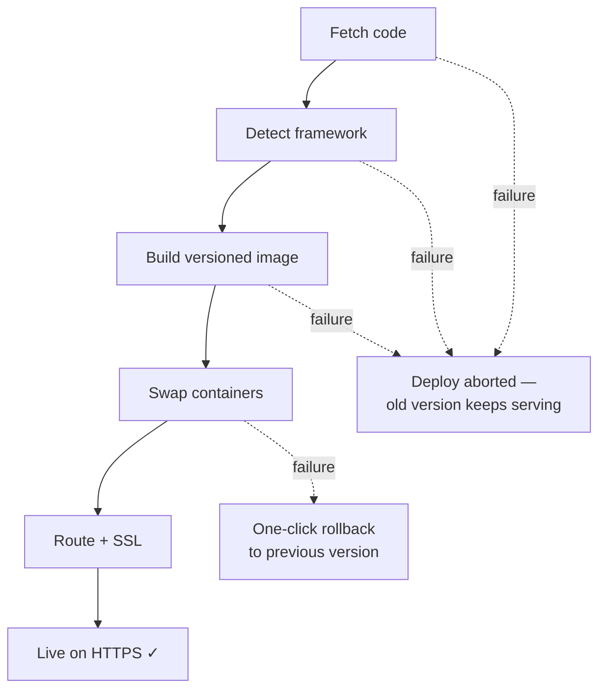

[← Back to overview](../README.md)

# The Deployment Pipeline

This is the core of AODE: you point it at a Git repository, and it turns that repository into a running, HTTPS-secured, versioned application on your own server. No Dockerfile required, no YAML, no CI configuration. This document describes what the pipeline does and how it behaves — including under failure. The implementation specifics stay private (AODE is a commercial product); I'm happy to go deeper in a technical interview.

Everything described here is running in production at [theaode.com](https://theaode.com). You can watch it work in the [read-only demo](https://demo.theaode.com).

## The lifecycle

**1. Clone.** AODE supports **GitHub, GitLab, and Bitbucket**, public or private repositories. Private-repo credentials are stored encrypted at rest and never appear in logs or error output. A repo that can't be fetched fails the deploy immediately and loudly — before anything else runs.

**2. Framework detection.** Once the code is on disk, AODE figures out what it is — **16 frameworks and runtimes** are recognized (Node.js, Next.js, Vite, Create React App, Python, Django, Flask, Go, Rust, Java, Spring Boot, PHP, Laravel, Ruby, .NET, static HTML). The output is a complete build recipe: how to install, build, start, and which port the app serves. The user answers none of those questions unless they want to override the defaults.

**3. Containerization.** AODE produces the container build itself from the detected recipe — the user needs zero Docker knowledge, every project of the same type builds the same proven way, and rebuilds stay fast. If a repository **contains its own Dockerfile, AODE respects it** and power users lose nothing.

**4. Versioned build.** Each build produces an immutable, versioned image, and previous versions are kept. This sounds mundane; it's the single most important design decision in the pipeline, because it's what makes rollback trivial (more below). Build output streams live to the dashboard.

**5. Run.** The new container starts with resource limits (one runaway app can't starve the host), environment variables injected from the portal's env editor, and no directly exposed ports — nothing is reachable except through the reverse proxy.

**6. Route + SSL.** AODE wires the project's domain to the new container; Traefik picks up the change without a proxy restart, and Let's Encrypt certificates are issued and renewed automatically. HTTPS is not a feature you enable; it's the default state of every deployed app.

## Behavior under failure

Every stage can fail, and the failure behavior is deliberate: **a failed deploy never takes down the running version.** Clone, detection, and build all happen while the old version keeps serving traffic — so the most failure-prone stages cost users nothing. A failed build leaves the full log one click away in the dashboard; a container that won't start leaves the previous version ready for one-click rollback.

## Redeploys: push-to-deploy or one click

- **Webhook push-to-deploy** — push to the tracked branch on GitHub, GitLab, or Bitbucket and the pipeline runs automatically. Webhook payloads are signature-verified before anything executes.
- **One-click redeploy** — a button in the dashboard triggers the same pipeline manually.

Either way, detection re-runs (a project that changed frameworks just keeps working), a new versioned image is built, and a **deployment record** is written: version, exact commit, build duration. The dashboard shows the full history per project.

## Rollback: instant, because the artifact already exists

Rollback is one click and takes seconds: the previous version already exists as an immutable image, so recovery is re-running something that already ran in production.

| | Images as artifacts (AODE) | Git revert + rebuild |
|---|---|---|
| Time to recover | Seconds | Minutes — full build cycle |
| Can the recovery itself fail? | Essentially no | Yes — rebuilds can fail, dependencies shift |
| What exactly are you running? | Bit-for-bit what ran before | A fresh build that *should* be equivalent |
| Works when Git is unreachable? | Yes | No |

The last two rows are the real argument. When production is broken, the last thing you want is a recovery path that can itself fail.

## Environment variables and database provisioning

- **Env editor** — every project has a variable editor in the dashboard; changes apply on the next start or redeploy.
- **`.env.example` detection** — if the repo ships one, AODE surfaces the expected variables so users fill in values instead of guessing.
- **One-click PostgreSQL** — a project can provision its own PostgreSQL database from the dashboard, with connection variables injected automatically. Shared databases across projects are supported.

## What was hard

The pipeline's failure behavior wasn't designed on a whiteboard — it was earned. The three problems that taught me the most: a redeploy path that could report success without actually shipping new code (the fix reshaped how every stage reports failure — a stage that can "succeed" without doing its job is worse than one that fails loudly); multi-project port and routing collisions on a shared host (eliminated by construction rather than prevented by bookkeeping); and keeping deploys safe on a server the platform doesn't own, where "the deploy failed" must never escalate into "the server is down." The war stories, with specifics, are good interview material.

---

*Next: [Architecture](architecture.md) · [Operations & monitoring](operations.md) · or back to the [overview](../README.md).*
