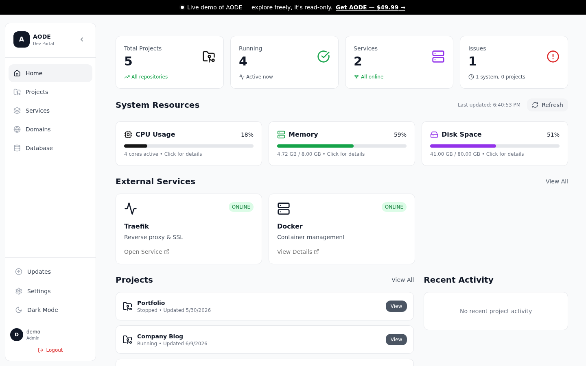
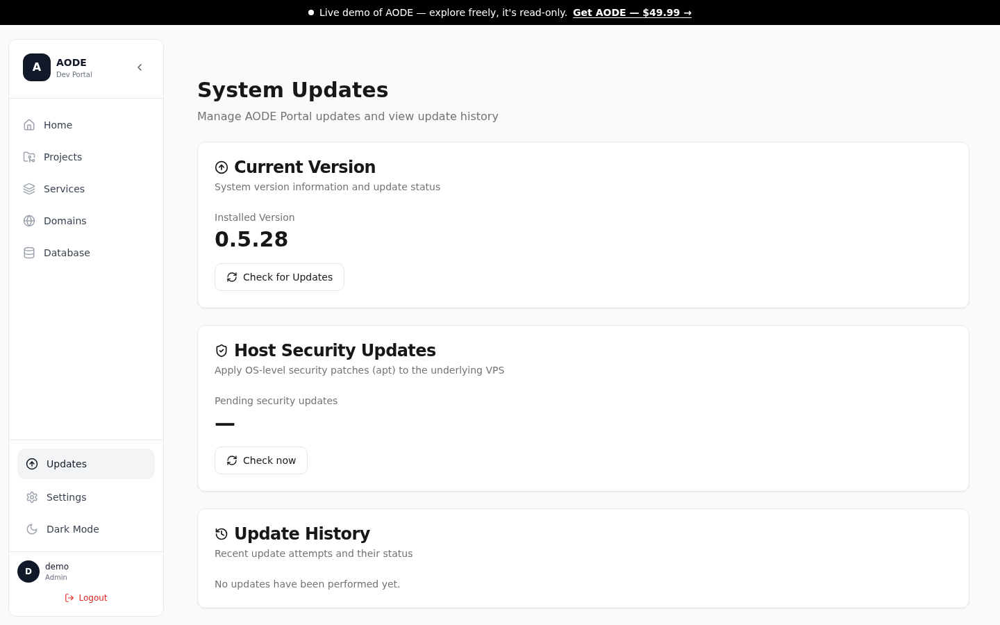
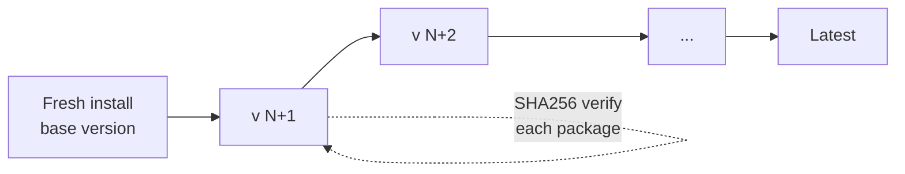

[← Back to overview](../README.md)

# Operations: Running It, Not Just Shipping It

Shipping is half the job. AODE isn't a portfolio prototype — it's a commercial platform I run in production at [theaode.com](https://theaode.com), with paying-customer installs on machines I will never touch. That constraint shaped the product: every operational task I'd otherwise do over SSH had to become a feature in the portal. This page covers how the platform monitors itself, alerts me, maintains itself, and ships updates to installs I can't reach.

> Want to see it live? The [read-only demo](https://demo.theaode.com) includes the monitoring and alerting screens with representative data.

---

## Monitoring

I treat the portal as the single pane of glass for the whole VPS — host, containers, and the apps deployed on top.

- **Host metrics** — CPU, memory, disk, and network are sampled continuously and stored as time-series data, so I can see trends (a disk slowly filling, a memory leak building) rather than just point-in-time snapshots.
- **Per-container stats** — every deployed project exposes live container-level CPU and memory usage, straight from the Docker Engine API. When a customer app misbehaves, I see *which* container, not just "the server is slow."
- **Traffic analytics** — request analytics per project and per custom domain, so a traffic spike is attributable to a specific app and hostname.
- **Live log viewers** — three distinct log surfaces in the UI, because they answer different questions:
  - *Application logs* — the container's stdout/stderr, for "why is this app failing at runtime?"
  - *Build logs* — the full Docker build output per deployment, for "why did this deploy fail?"
  - *System logs* — portal and host-level events, for "what happened to the platform itself?"



---

## Alerting

Metrics you have to remember to look at aren't monitoring. The platform raises **system alerts** when thresholds are crossed — disk pressure, memory pressure, container failures — and delivers them by email.

Two design decisions matter here:

1. **Deduplication.** A disk that sits at 91% for six hours is *one* problem, not 360 problems. Alerts are deduplicated so a persistent condition produces a single active alert instead of a flood. This is the difference between alerts I act on and alerts I filter to a folder and ignore — alert fatigue is how real incidents get missed, and dedup is the cheapest defense against it.
2. **Notification preferences.** Users choose which alert categories reach them and how. An operator who wants everything and a user who only cares about their own deployments shouldn't get the same firehose.

Delivery runs through a **self-hosted mail server** with SPF, DKIM, and DMARC configured — the same infrastructure that handles license delivery. The portal also supports multiple SMTP accounts and email templates, so alerting isn't hardwired to one mailbox.


---

## Self-Maintenance

A platform operated by one person — and installed on customer servers by people who aren't sysadmins — has to look after itself.

- **Automated backups** — the portal database and configuration are backed up on a schedule, and backups are downloadable from the UI.
- **Disk-space management** — Docker is a silent disk eater: build cache, dangling layers, and old versioned images accumulate until the machine falls over. The platform tracks disk usage, alerts on pressure, and cleans up stale artifacts on a schedule instead of waiting for a 100%-full incident.
- **Scheduled automation** — recurring maintenance tasks (cleanups, backup rotation, metric collection) run as scheduled jobs with execution history, so I can verify they actually ran — a cron job that silently stopped is worse than no cron job.
- **Host OS security updates from the UI** — this is the one I'm proudest of. The portal detects pending OS security updates on the host and applies them with one click, streaming logs into the UI and recording every run. A customer running AODE on their own VPS can keep the *host* patched without ever opening a terminal. Update history is persisted, so "when was this box last patched?" has an answer.



---

## Release Engineering

This is where operating a distributed commercial product differs most from running a single app. Every AODE install lives on someone else's server, so releases have to be safe *without me in the loop*.

- **Versioned releases.** Every release is a versioned, self-contained update package.
- **Chained in-app updates.** A fresh install lands on a known base version and then updates **release-by-release** through the chain to latest. I chose chained updates over big-bang "jump to latest" deliberately:
  - Each release's migrations and upgrade steps run in order, against the exact state the previous release left behind — the same path every existing install already took.
  - I only ever have to test *N → N+1*, not every historical version against latest. The test matrix stays linear instead of combinatorial.
  - A failure is isolated to one small step with a known-good version on either side, instead of a half-applied mega-upgrade.
- **SHA256-verified packages.** Update packages are checksum-verified before they're applied. An install never executes a payload that doesn't match its published hash.
- **Rollback path.** Deployed *apps* roll back with one click to any previous versioned image, and the platform's own update process keeps the prior version available so a bad release doesn't strand an install.



---

## The Installer

The whole distribution story compresses into one command on a fresh VPS:

```bash
curl -fsSL https://install.aode.tech/install-secure.sh | sudo bash -s <LICENSE-KEY>
```

What that does: validates the license key against the licensing API, downloads the platform package with SHA256 verification, sets up Docker, Traefik, and the portal, and brings the whole system up. From blank server to a working deployment platform with SSL takes minutes — and because of the chained update system, that fresh install immediately walks itself forward to the latest release. First impressions are an ops feature: if the installer is flaky, nothing else about the product matters.

---

## Operating Solo

I designed, built, and operate this platform alone. That's not a flex — it's a forcing function. Anything I do manually twice becomes a bug in my process, so the operational surface is deliberately automated:

- **Health checks** — a single diagnostic pass that reports container states, portal version, database health, disk/memory/CPU, routing, and recent errors in seconds. I run it at the start of every working session instead of poking at things ad hoc.
- **Incident snapshots** — when something breaks, one command captures logs, alerts, metrics, and system state into a triage bundle *before* I start changing things, so I always have a baseline to diff against.
- **Runbooks** — releases, updates, and recurring maintenance follow written, verifiable procedures rather than memory. If a step can be checked, the runbook checks it.

Much of this is executed through an **AI-assisted engineering workflow** — the health checks, incident diagnostics, and the release procedure itself run as automated, guard-railed workflows that I supervise rather than perform by hand. That system, including the guardrails that make it safe to run against production, is documented in [ai-workflow.md](ai-workflow.md).

The takeaway I'd offer from operating a commercial platform solo: **operability is a product feature.** Every monitoring screen, alert rule, and one-click maintenance action exists because either I needed it at 2 AM, or a customer who isn't a sysadmin needed it to never have a 2 AM.

---

[← Back to overview](../README.md) · [Architecture](architecture.md) · [Deployment pipeline](deployment-pipeline.md) · [AI workflow](ai-workflow.md)
